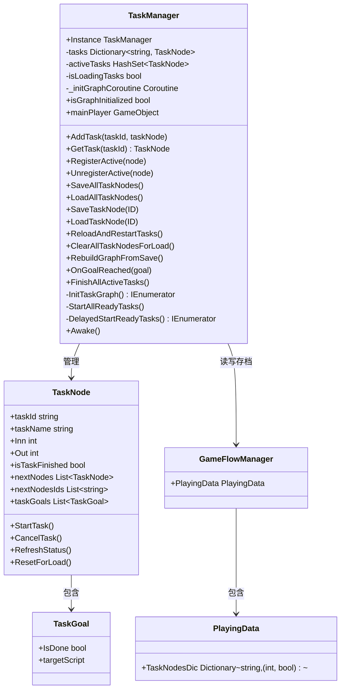
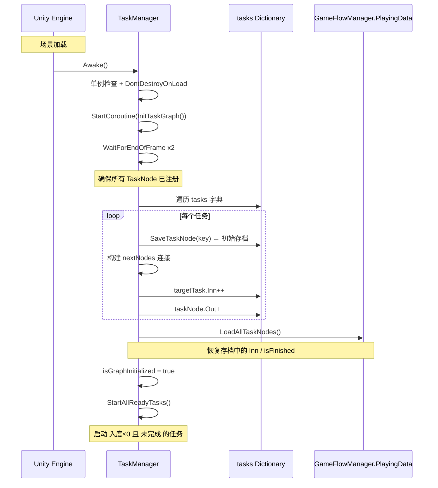
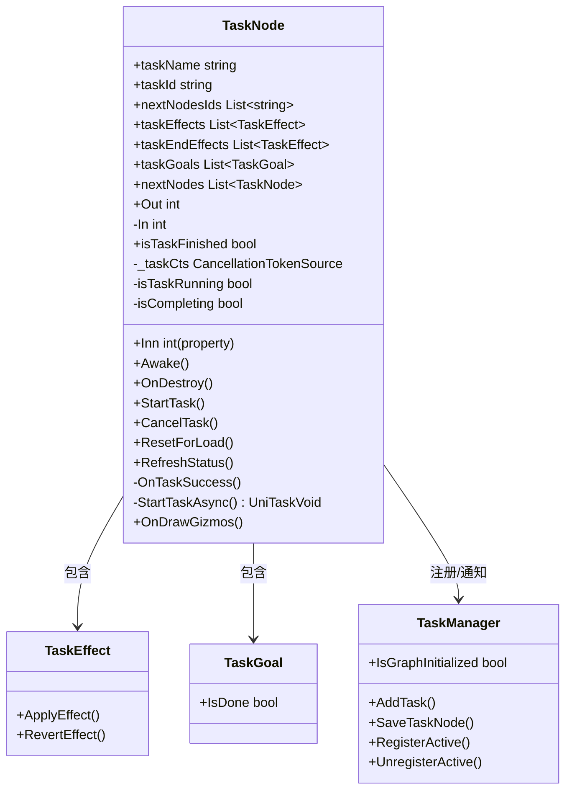
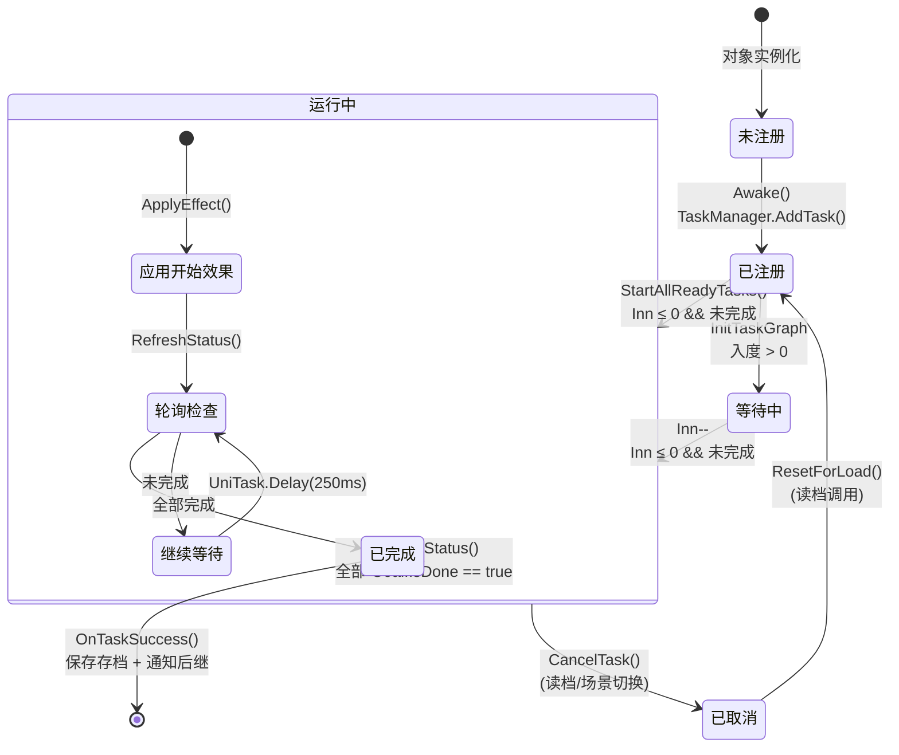
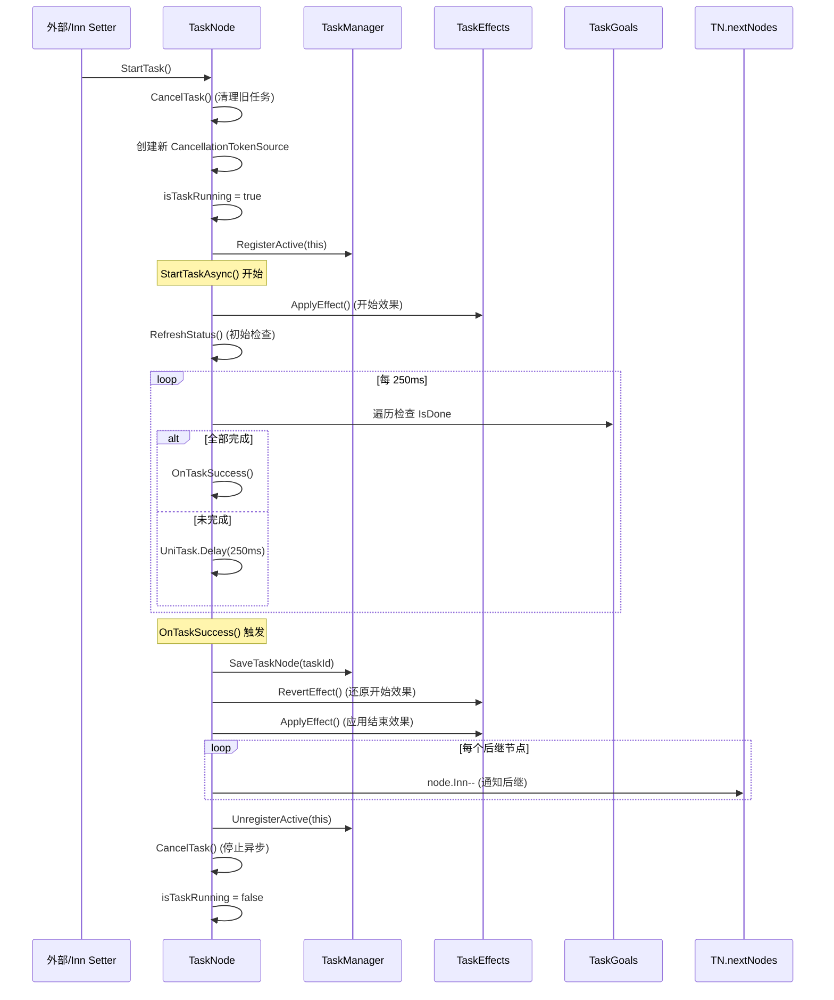

# 基于DAG的任务管理系统（依存关系管理器）

本文将对一个基于 $\text{DAG}$ 的任务管理系统实现详细逻辑和代码拆解。

（基于 Unity 实现）

## 理论基底讲解

我们知道 $\text{DAG}$ 是有向无环图，而在 $\text{DAG}$ 上可以进行拓扑排序，我们发现拓扑排序的本质就是按照节点依赖关系进行排序，所以我们便可以利用这个进行管理任何依存关系。

是的，任意依存关系，所以这个实现的任务管理系统过于底层，我们完全可以在不进行高级封装的情况下将其使用在任何有依存关系的地方。

另外，这个任务管理系统因为过于底层，所以几乎没有复杂度浪费，在不进行系统层级上的优化的情况下性能已经非常高，当然更多的还可能取决于具体实现与内存管理，但是这不会有理论复杂度的区别。

## 程序结构分析

### TaskManager 脚本

按照 Unity 风格，我们习惯用一个脚本实现为单例，负责注册服务和事件。

也就是我们的 TaskManager 脚本。

我们使用这个脚本进行任务节点初始化，节点出入度的统一管理还有一些调试功能的实现。

这个脚本相当于整个系统的管理器与统一调度器。

此脚本也实现了存档功能，这重点是与存档系统合理对接然后重新初始化，不在此赘述。

以下是任务初始化流程图：

（注：这里的 GameFlowManager 是游戏流程管理器，这里主要负责游戏数据的对接）

### TaskNode 脚本

这个脚本实现了 TaskNode 类，作为 $\text{DAG}$ 的节点实例化.

结构图：

我们在这里实现对于任务节点的信息存储（如：出度，入度，任务效果，任务目标等），也实现了任务节点的启动逻辑，结束逻辑。

为了便于解耦，我们的任务流程使用 Unitask 实现，Unitask 是一个更优秀的异步库，可以便携地对异步函数进行取消，异常处理等操作。

以下是 TaskNode 对象的生命周期流程图：

以下是 TaskNode 的运行逻辑流程图：

### TaskEffect,TaskGoal,TaskBasic 脚本

TaskEffect 和 TaskGoal 脚本都是作为纯粹的数据类存在，为了可以在 Inspector 中序列化方便配置而存在。

需要注意的是，这两个脚本都强烈跟游戏的数据管理系统结合，所以并无很大的参考价值。

而 TaskBasic 则是为了自定义 TaskGoal 和 TaskEffect 而存在的基类，TaskBasic 中定义了自定义脚本的基本实现规则和属性，确保自定义脚本实现方便并且使用安全。

## 附录

[TaskManager](content\post\基于DAG的任务管理系统\TaskBasic.cs)

[TaskNode](content\post\基于DAG的任务管理系统\TaskNode.cs)

[TaskEffect](content\post\基于DAG的任务管理系统\TaskEffect.cs)

[TaskGoal](content\post\基于DAG的任务管理系统\TaskGoal.cs)

[TaskBasic](content\post\基于DAG的任务管理系统\TaskBasic.cs)
